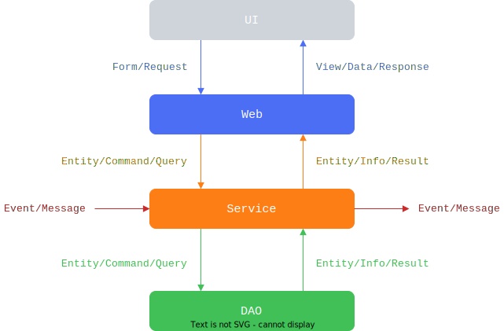

## 命名模式

定义了在分层架构中每一层传入/传出参数的命名模式。



提供了 `BaseEntity`、`BaseForm`、`BaseView`、`BaseCommand`、`BaseResult` 几个基础类。 同时使用 `RestResult` 类统一前后端返回参数的结构。

## 错误码规则

将错误码（`ErrorCode`）分为两类：系统错误码（`SystemErrorCode`）和业务错误码（`BusinessErrorCode`），它们都是整数。

系统错误码是与业务无关的通用错误码，它们的取值范围为 0~99，其中 0 表示操作成功。

业务错误码是与具体业务有关的错误码，是在处理业务的过程中因违反业务规则时抛出的错误码，它们由两部分组成：模块编码（2 位）和错误编号（3 位）。模块编码由 `Module` 类定义，取值范围为 10~99。错误编号的取值范围为 1~999。可以将 `BusinessErrorCode` 作为参数传给 `BusinessException` 类创建业务异常。

## ID 生成器

ID 生成器使用了雪花算法，模仿 MongoDB 的 `ObjectId` 生成 `datacenterId` 和 `workerId`。

## 链路追踪 ID

尝试从请求头 `Trace-Id` 获取链路追踪 ID，如果没获取到则自定义一个。从请求头获取的好处是可以将前后端系统打通。

## 异常处理器

1. `ValidationExceptionHandler`：处理参数验证异常；
2. `DatabaseExceptionHandler`：处理访问数据库时出现的异常；
3. `BusinessExceptionHandler`：处理业务异常；
4. `GlobalExceptionHandler`：处理全局异常，即没有异常处理器处理的异常；

## 响应参数处理器

在 `Controller` 中的方法的返回参数的类型可以是 `ResultResult` 类，也可以是其他类型。

## 分布式锁

基于 Redis 实现了一个简单的分布式锁，在需要加锁的方法上添加 `@Lockable` 注解即可，支持 SpEL 表达式。

## 数据库读写分离

主从数据源配置示例

```yaml
duck:
  datasource:
    hikari:
      primary:
        jdbc-url: jdbc:mysql://localhost:3306/duck_primary?characterEncoding=UTF-8&serverTimezone=GMT%2B8
        driver-class-name: com.mysql.cj.jdbc.Driver
        username: root
        password: 123456
      replica:
        jdbc-url: jdbc:mysql://localhost:3306/duck_replica?characterEncoding=UTF-8&serverTimezone=GMT%2B8
        driver-class-name: com.mysql.cj.jdbc.Driver
        username: root
        password: 123456
```

默认使用主库，可以使用 `@DataSourceSelector` 注解切换从库。

## 缓存扩展

在使用 Spring Cache 的基础上使用 `@CacheExtension` 注解定义缓存过期时间。

## Swagger 文档

增强 SpringDoc 文档，无论 `Controller` 方法返回值是否是 `ResultResult` 类均有一致的文档结构。
